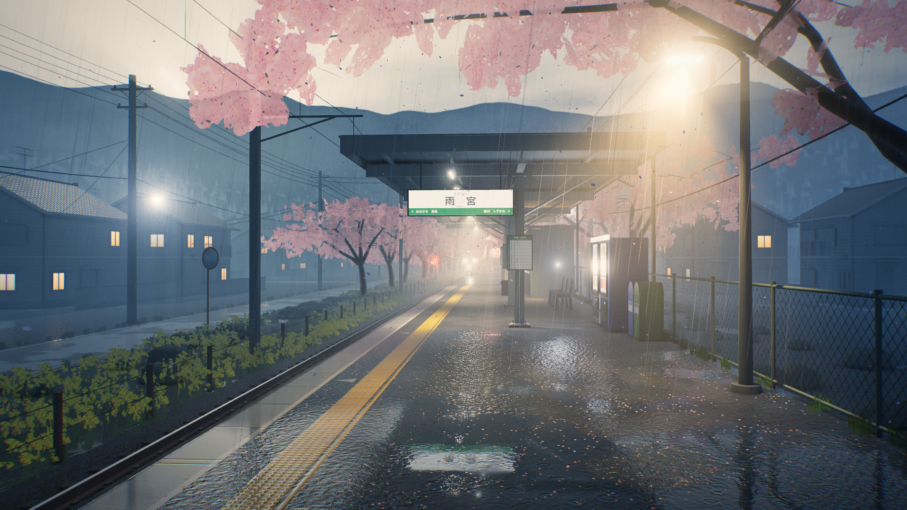

# 雨宮駅・春雨：three.js 雨天車站場景

雨天、起霧的日本春季小車站，以新海誠式的光影為目標。整個場景是單一 HTML 檔：three.js r186 透過 import map 從 jsDelivr 載入，所有貼圖都在瀏覽器中程序化生成，沒有任何外部素材。



## 開啟方式

- 直接開啟 `index.html`（需要網路載入 three.js）；或
- 在專案根目錄啟動任一靜態伺服器，例如 `npx serve .`，再開啟 `http://localhost:3000`。

| 操作 | 作用 |
|---|---|
| 拖曳 | 在限制角度內環顧 |
| `Space` | 暫停或繼續時間（雨、花瓣、平交道號誌） |
| `H` | 顯示或隱藏標題與提示 |

| URL 參數 | 作用 |
|---|---|
| `?q=low` / `med` / `high` | 畫質預設，影響解析度、MSAA、陰影、霧的步數、粒子數。預設為桌機 high、窄螢幕 low；不指定時，即時模式會依幀率自動降低解析度 |
| `?t=14.2` | 固定時間 |
| `?shot` | 固定為單幀、關閉攝影機晃動，供截圖使用 |
| `?debug=nofog` / `nofx` / `norays` / `nobloom` / `noao` / `ao` | 逐項關閉效果，或只顯示 SSAO，用於診斷 |

## 需求對照

| 需求 | 實作 |
|---|---|
| three.js 最新版、import map | `three@0.186.1`，`three` 與 `three/addons/` 都映射到 jsDelivr |
| EffectComposer + UnrealBloomPass | 以 `EffectComposer` 串接自訂 pass。Bloom 的大半徑 mip 染暖色，燈光周圍呈現底片 halation |
| SSAO | `SSAOPass` 子類別，32 個 kernel、半徑 0.55 m；天空、Alpha 花卡、電線、粒子排除在法線 pass 之外 |
| 濕地面反射 | 兩個平面鏡射（月台面、地面／道路），用 oblique near-plane 裁切。反射依粗糙度取 mip 並加上垂直拉長取樣，再乘上 Fresnel。水窪遮罩、雙層雨滴漣漪法線、屋簷下較乾 |
| 體積霧 | ① 覆寫所有材質的 fog chunk，改為指數高度霧並依太陽方向染色，主畫面、鏡射、粒子共用同一套大氣。② raymarch 體積霧 pass：3D 噪聲霧團、向下捲動的雨幕，14 盞燈以 HG 相函數散射。③ 螢幕空間光芒 |
| 雨滴與櫻花粒子 | 約 2.6 萬條 instanced 雨絲、屋簷滴水、濺水花冠、近鏡頭失焦雨；三組旋轉翻滾的花瓣（Points）；約 5200 片依水窪分佈的落花。粒子都與場景深度做軟遮擋，並被燈光照亮 |
| 軟陰影 | `PCFShadowMap` 搭配 `shadow.radius`。r186 已移除 `PCFSoftShadowMap`，PCF 本身改用 Vogel disk 軟取樣。投影光源為方向光與 3 盞 SpotLight |

## 迭代過程

共五輪，每輪都有 Playwright 截圖、自我檢查（電影感光影、大氣透視、色彩層次）、量化數據與修改說明：
**[`iterations/README.md`](iterations/README.md)**

## 目錄

```
index.html                 最終場景（單一檔案）
iterations/
  README.md                每輪截圖、問題、修改說明與數據
  contact-sheet.jpg        五輪對照
  final-1920x1080.png      最終 1080p 截圖
  round-N/index.html       第 N 輪的 HTML 快照
  round-N/round-N.png      第 N 輪截圖（1600×900，t = 14.2）
tools/
  shoot.mjs                Playwright 截圖（把 CDN 請求導向本地 node_modules）
  analyze.py               截圖的亮度、飽和度、冷暖統計
```

## 重現截圖

```bash
cd tools && npm install                 # three@0.186.1 + playwright（另需 Chromium：npx playwright install chromium）
node shoot.mjs index.html iterations/final-1920x1080.png --w 1920 --h 1080 --t 14.2
python3 analyze.py ../iterations/final-1920x1080.png   # 需要 pillow、numpy
```

`shoot.mjs` 使用 SwiftShader 軟體 WebGL2，1080p 一張約需 2 分鐘。場景是為實體 GPU 上的即時播放設計的，但本環境只能軟體渲染，實際 GPU 幀率未經實測；若幀率不足，即時模式會自動降低解析度，也可以改用 `?q=med` 或 `?q=low`。
