# 迭代紀錄：雨宮駅・春雨

- **第 1–5 輪**：光影、大氣與色彩。
- **第 6–8 輪**：依使用者要求提升建模精細度，特寫對照見 [`modelling-closeups.jpg`](modelling-closeups.jpg)。
- **第 9–12 輪**：使用者覺得「還是有些假」，於是逐一處理最不真實的地方，特寫對照見 [`realism-closeups.jpg`](realism-closeups.jpg)。

## 流程

每一輪都照同一個循環進行：

1. 修改 `index.html`。
2. 用 Playwright（`tools/shoot.mjs`）截圖，時間固定在 `t=14.2`，解析度 1600×900，雨滴位置與號誌閃爍相位每輪都相同。
3. 對照三個檢查項目自我審查：**電影感光影**、**大氣透視**、**色彩層次**。需要時裁切局部放大，或用 `&debug=nofog / nofx / norays / ao` 關掉單一效果來定位問題。
4. 用 `tools/analyze.py` 量化截圖，作為肉眼判斷的佐證。
5. 列出問題，交給下一輪修正。

一輪之內若嘗試了幾次，下面會寫出中途發現的問題。每一輪的 HTML 快照與截圖都保存在 `round-N/`，可以直接開啟 `round-N/index.html` 看當時的即時版本。

### 指標說明

所有數值都以 sRGB 顯示值計算，範圍 0–1。

| 指標 | 意義 |
|---|---|
| `p5 / p50 / p95` | 亮度的 5% 分位、中位數、95% 分位：畫面有沒有真正的暗部與亮部 |
| `contrast` | p95 − p5 |
| `sat` | 平均飽和度 |
| `warm / cool` | 明顯偏暖（R > B）與明顯偏冷（B > R）的像素比例 |
| 三帶 `L / σ / S` | 畫面上、中、下三等分各自的平均亮度、亮度標準差、飽和度 |

三帶數值只用來追蹤天空亮度與前景暗度。中景帶同時包含最亮的燈與最鮮豔的櫻花，所以大氣透視主要還是靠裁切圖目視判斷，不硬套數字。

### 各輪數值總覽（1600×900 截圖）

| 輪次 | p5 | p50 | p95 | contrast | sat | warm | cool | 上帶 L/σ/S | 中帶 L/σ/S | 下帶 L/σ/S |
|---|---|---|---|---|---|---|---|---|---|---|
| 1 | 0.339 | 0.661 | 0.942 | 0.603 | 0.140 | **0.61** | 0.19 | 0.69 / .154 / .15 | 0.68 / .157 / .12 | 0.61 / .215 / .15 |
| 2 | 0.158 | 0.432 | 0.839 | 0.682 | 0.257 | 0.35 | 0.53 | 0.65 / .183 / .22 | 0.46 / .172 / .29 | 0.30 / .129 / .27 |
| 3 | 0.176 | 0.416 | 0.796 | 0.620 | 0.259 | 0.25 | 0.60 | 0.57 / .199 / .23 | 0.45 / .141 / .29 | 0.32 / .128 / .26 |
| 4 | 0.157 | 0.462 | 0.882 | 0.725 | 0.220 | 0.32 | 0.46 | 0.64 / .209 / .18 | 0.51 / .172 / .23 | 0.30 / .143 / .25 |
| 5 | 0.153 | 0.427 | 0.856 | 0.703 | 0.245 | 0.31 | 0.49 | 0.59 / .211 / .22 | 0.49 / .174 / .26 | 0.30 / .139 / .26 |
| 6 | 0.150 | 0.427 | 0.854 | 0.704 | 0.246 | 0.34 | 0.46 | 0.61 / .209 / .22 | 0.47 / .159 / .27 | 0.29 / .134 / .25 |
| 7 | 0.149 | 0.422 | 0.854 | 0.704 | 0.248 | 0.34 | 0.45 | 0.61 / .207 / .22 | 0.45 / .170 / .27 | 0.29 / .134 / .25 |
| 8 | 0.147 | 0.419 | 0.854 | 0.707 | 0.249 | 0.34 | 0.45 | 0.61 / .209 / .22 | 0.45 / .169 / .27 | 0.29 / .134 / .26 |
| 9 | 0.153 | 0.422 | 0.870 | 0.717 | 0.233 | 0.32 | 0.47 | 0.63 / .216 / .20 | 0.45 / .167 / .27 | 0.29 / .131 / .23 |
| 10 | 0.152 | 0.418 | 0.870 | 0.717 | 0.235 | 0.32 | 0.47 | 0.63 / .215 / .20 | 0.44 / .177 / .28 | 0.29 / .131 / .23 |
| 11 | 0.153 | 0.414 | 0.869 | 0.716 | 0.234 | 0.32 | 0.47 | 0.63 / .217 / .20 | 0.44 / .177 / .28 | 0.29 / .131 / .23 |
| 12 | 0.156 | 0.413 | 0.864 | 0.708 | 0.242 | 0.34 | 0.45 | 0.62 / .217 / .21 | 0.44 / .178 / .28 | 0.30 / .130 / .23 |

---

## Round 1：首版完整場景

### 實作內容

- **場景**：單側月台，包含濕柏油、緣石、點字磚與內方線；月台上有上屋、日光燈、吊掛站名標「雨宮」、自動販賣機、長椅、候車室與燈柱。另有單線鐵軌、架空電車線、路邊電線桿與電線，遠處是亮著紅燈的平交道。櫻花含一棵主樹、一整排行道樹，遠山上也有櫻花；再加上民家、地形、杉林。
- **管線**：場景本身渲染到 4× MSAA、HalfFloat、帶深度貼圖的 RT。後處理依序為 SSAOPass、體積霧、粒子、UnrealBloomPass、OutputPass（ACES 色調映射）、顯示空間調色。
- **濕地面**：月台平面做平面鏡射（oblique near-plane 裁切）。反射依粗糙度取 mip 並加上垂直拉長取樣，再乘上 Fresnel。水窪遮罩與雨滴漣漪法線寫在 shader 裡。
- **霧**：覆寫所有材質的 fog chunk，改為指數高度霧，並依太陽方向染色。另有一個 raymarch 體積霧 pass，使用 3D 噪聲，燈光以 HG 相函數散射。
- **粒子**：雨絲用 instanced 長條，另有屋簷滴水、濺水花冠、旋轉翻滾的櫻花瓣。粒子與場景深度比較做軟遮擋，並自行套用同一套大氣霧。

### 自我檢查

- **電影感光影 ✗**
  - 左側鐵軌上有巨大的白色光斑，並沿軌道延伸成光帶。用 `debug=nofog`、`debug=nofx` 排除後，光斑依然存在，所以不是霧也不是粒子。
  - 從螢幕座標反推這塊光斑所在的射線方位，是左偏 21.7°，與太陽方位 21.4° 吻合。結論：低角度方向光在低粗糙度的濕路面與鋼軌頂上形成鏡面高光。陰雨天不應出現這種硬直射光。
  - 整體過亮，燈光沒有「在昏暗中發光」的力量。
- **大氣透視 △**：遠方行道樹有漸層，但霧色太亮，連近景民家都被洗白，近、中、遠三層分不開。天空一片白，沒有雲的結構。
- **色彩層次 ✗**：灰白單調，飽和度只有 0.14；偏暖像素反而佔 61%，與雨天冷調相反。櫻花卡片上一朵朵大花太碎，看起來像雜訊。
- **其他**：雨絲幾乎看不見，因為背景太亮。漣漪太大太規則，半徑約 50 cm。

---

## Round 2：光影與色調重建

### 修改

1. **消除光斑**：先把方向光從 1.1 降到 0.3，陰天只保留一點方向感。第一次重拍後，路面與鋼軌上仍有兩個小光點，因此把「天空光暈的方向」與「實際照明的方向」拆開：
   - 天空與霧的太陽光暈維持低角度，保留逆光構圖；
   - 投影用的方向光抬高到仰角 40°，讓鏡面反射點落到畫面下緣以外。
2. **色調**：
   - 霧色 `#8d9ba8` → `#5f7383`，天頂 0.20 → 0.075；
   - 半球光 0.55 → 0.35，環境光 0.55 → 0.40，曝光 1.0 → 0.9；
   - 陰影的 split toning 更偏藍綠。
3. **天空**：加厚雨雲，雲底較暗；朝太陽的雲緣加上銀邊。
4. **櫻花**：
   - 第一次加深色調後，花團在 alpha-to-coverage 下變成網點狀的「紗窗」，原因是卡片大部分是空洞。
   - 因此重畫花卡：先畫實心的花團輪廓，上亮下深；再在輪廓與內部密布小花，邊緣讀起來是花瓣而不是圓盤；最後挖幾個透氣小孔。
   - 加入背光透射：當花團位於觀者與天空亮區之間時，發出暖色的透光。
5. **雨**：雨絲 alpha 0.32 → 0.6，並加寬、加長；燈光照亮雨絲的增益提高。體積霧裡加入垂直拉長、向下捲動的噪聲，形成遠處的雨幕。
6. **漣漪**：頻率約提高 2.2 倍，改為兩層疊加；非水窪處的強度降低。
7. **販賣機**：自發光 3.2 → 1.7，從死白恢復到看得見飲料。

### 自我檢查

- **電影感光影 △**：已經有雨夜車站的氣氛，冷霧與暖燈成對比。但主櫻樹樹冠擋住大半天空，缺少主光源的戲劇性。
- **大氣透視 ✓ / ✗**：山的剪影出來了。但左側鐵道邊是一整片平坦的暗色，而且地面層的道路與草地沒有任何反射。
- **色彩層次 ✓**：冷色 53%，飽和度 0.26，暗部 p5 從 0.34 降到 0.16。

---

## Round 3：構圖、地面反射、景深層次

### 修改

1. **第二個平面反射**：在地面高度 y = −1.41 加一面鏡射，道路、草地、平交道路面都能倒映燈光與櫻花。濕材質重構成可以指定要用哪一個反射平面，每種表面各自設定濕度、水窪閾值、反射強度與水窪尺度。
2. **主櫻樹**：往後、往右移，讓樹冠成為畫面上緣的「框」，露出天空與山稜線。第一次移動後，垂下的枝條擋住了站名牌，於是再把樹幹從 2.6 m 加長到 3.4 m。
3. **樹冠自遮蔽**：依花團到樹冠中心的距離與高度，算出每個 instance 的明暗。內側與下方較暗、偏深粉，外側上方較亮。
4. **鐵道邊細節**：加上木樁與鐵絲圍籬、灌木、菜の花（油菜花）。菜の花在青藍陰影與粉紅櫻花之間補上一條黃色帶。第一版灌木太黑太大，像黑色團塊，之後改小、改亮。
5. **鋼軌**：頂面反射提高到 envMapIntensity 2.6，找回通往消失點的引導線。第一次重拍時發現，環境光變暗後鋼軌幾乎消失了。

### 自我檢查

- **構圖 ✓**：前景是濕月台，中景是上屋與站名牌，遠景是行道樹與層層山稜，三層清楚。
- **電影感光影 ✗**：光線仍然偏平。沒有主光焦點，燈在雨中的光錐幾乎看不到，暗部也偏灰（p5 = 0.176）。
- **大氣透視 ✓**：遠山分成深淺數層，行道樹沒入霧中。
- **色彩層次 ✓**：黃、粉、青藍、暖燈與紅色號誌各有位置；冷色 60%。

---

## Round 4：電影感光影（光芒、列車頭燈、光錐、底片調色）

### 修改

1. **光芒（crepuscular rays）pass**：以太陽在螢幕上的投影點為中心，沿徑向取樣 64 次，只累積「深度等於 1 的天空像素、且亮度超過閾值」的光。樹冠、電線、上屋擋住的地方就形成一道道光束。
   - 中途用 `debug=norays` 對照，發現開與關的數值只差 0.01，光芒幾乎無效。因此強度 1.0 → 2.6，閾值 0.4 → 0.3。
2. **遠方進站列車（兩節）**：頭燈是朝鏡頭照來的 SpotLight，在霧中形成消失點上的焦點光，並在鋼軌上拉出反光。它也解釋了平交道為什麼在閃。
   - 第一次設 2600 cd 太強，整個中景被洗白：p50 升到 0.53，暖色反而多於冷色。
   - 改為 900 cd、散射增益 0.45 後，成為一團克制的光。
3. **光錐**：月台燈與上屋燈的體積散射增益提高；霧的步進距離 95 → 135 m，步數 44 → 56。
4. **消除網點**：放大裁切時發現，體積霧的 IGN 抖動在亮光錐裡留下規則網點。改用白噪聲抖動後，看起來像底片顆粒，也像光錐中的雨。
5. **調色**：Bloom 的大半徑 mip 偏暖，燈光周圍有底片般的 halation，正好對比冷色的霧。顯示空間調色加入 S 曲線，並降低補光（半球 0.35 → 0.28，環境 0.40 → 0.34）。
6. **花團體積**：花卡法線沿卡片向外彎曲，每個花團有球狀的明暗。

### 自我檢查

- **電影感光影 ✓**：三個光源形成三角：消失點的頭燈、左上的雲隙光、右側燈柱光錐裡的斜雨。對比 contrast 從 0.62 升到 0.73。
- **大氣透視 ✓**：頭燈的光暈讓消失點方向的霧有了深度，列車本體幾乎被霧吞沒，只剩燈。
- **色彩層次 △**：前景除了倒影，缺少粉紅色的點綴，而前、中、遠三層都應該有櫻花色。太陽區域略為過曝。

---

## Round 5：細節收尾

### 修改

1. **地上落花**：從 1400 片增加到約 5200 片。落點用與 shader 相同的水窪噪聲計算，花瓣集中在水窪邊緣、漂在水面上、沿著圍欄與月台邊緣堆積，每片有新舊色差。前景因此也有了粉紅色。
2. **空中花瓣**：主樹下的花瓣加多，並在鏡頭前加一小群近景花瓣。
3. **近鏡頭雨層**：鏡頭前 2–5 m 內加一層寬而淡的雨絲，模擬失焦的近距離雨滴，加強景深感。
4. **太陽**：光暈與光芒強度略降，避免死白。
5. **自適應解析度**：只在即時模式啟用。若平均幀時間超過 1/28 秒，自動降低 render scale，最多兩次。用 `?q=` 指定畫質時不會觸發。

### 最終檢查

- **電影感光影 ✓**：焦點光源清楚、雨中光錐可見、燈光倒映在濕地面上，冷暖對比明確。
- **大氣透視 ✓**：以濕月台與落花為前景，上屋、站名牌與行道樹為中景，沒入霧中的列車燈、平交道與數層山稜為遠景。
- **色彩層次 ✓**：主調是青藍霧；暖色點綴有燈、窗與 halation；另外有粉紅櫻花（前、中、遠三層）、黃色菜の花、紅色號誌、綠色站名牌帶。冷 49% / 暖 31%，飽和度 0.245。

---

# 建模精細化（第 6–8 輪）

主畫面的鏡頭距離多數物件 10 m 以上，粗糙的模型不容易看出來，所以這三輪加入特寫機位 `?cam=station / roof / houses / track`，每輪同時檢查主畫面與四個特寫。第 6 輪開始前先拍下 Round 5 的特寫作為基準（`round-6/before/`）。

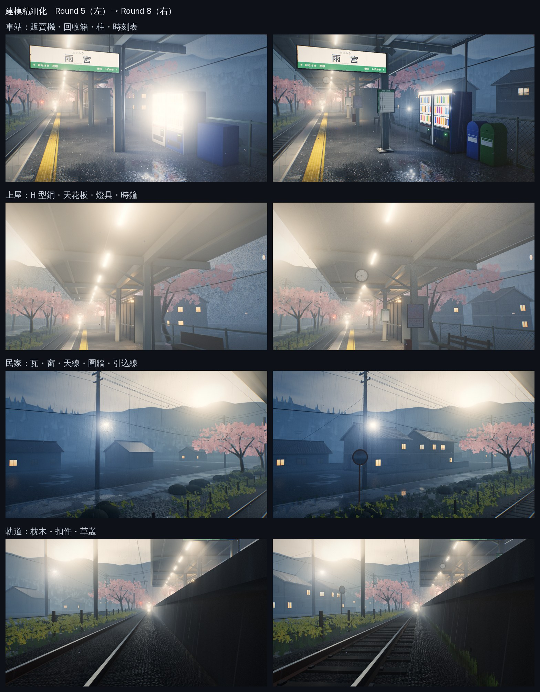

| 輪次 | 場景三角形數 | 1080p 軟體渲染時間 |
|---|---|---|
| 5 | 44.5 萬 | 約 130 秒 |
| 6 | 48.1 萬 | 約 64 秒（霧改用 equi-angular sampling） |
| 7 | 55.1 萬 | 約 64 秒 |
| 8 | 111 萬 | 約 85 秒 |

## Round 6：車站與軌道

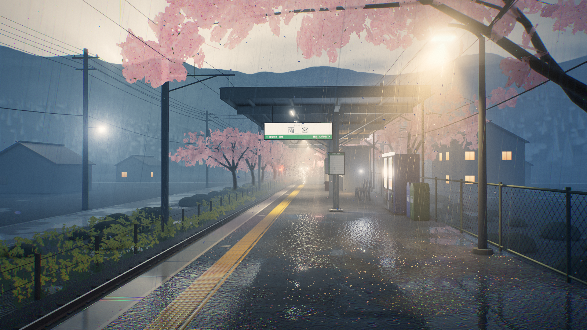

### 基準特寫發現的問題

- **軌道**：枕木完全被道碴埋住，看不見；鋼軌直接貼在碎石上。
- **上屋**：柱子、樑都是方盒；天花板是一整片平面；燈具只是兩個方塊。
- **販賣機與回收箱**：只是貼了貼圖的發光箱子，正面過曝，看不到任何飲料。
- **體積霧**：大面積的天空與光錐裡有很粗的顆粒雜訊。

### 修改

1. **上屋鋼構**：H 型鋼柱立在底板上，四角有錨栓，底下是混凝土墩；懸臂樑改成 I 型鋼，加上斜撐與角撐板；屋脊樑與檁條也是型鋼。天花板用 0.9 m 分格的貼圖，帶接縫與水漬。屋頂換成真正起伏的波浪浪板，鼻隱板加上壓頂。後側有半圓雨水槽，落水管附托架，下方有排水格柵。
2. **燈具與柱上設備**：日光燈改為梯形燈罩、圓管燈管與端蓋，以吊桿掛在檁條下。另外加上雙面時鐘（17:42）、兩面時刻表、「さくらまつり」海報、廣播喇叭與滅火器箱。
3. **販賣機**：圓角機身、帶框的展示窗、每層飲料下的按鈕台、投幣機構與綠色 LED、傾斜的取物口、上方燈箱、底座。展示面的漫反射調低，自發光改為主導，不再過曝，飲料陳列看得清楚。
4. **其他月台設施**：回收箱（圓頂蓋、投入口、「かん・びん／ペットボトル」標籤）、三支鑄鐵腳的條板長椅、鵝頸式燈柱、鋼管柱加菱形網片的圍欄；月台側壁加上伸縮縫與排水孔。
5. **軌道**：道碴頂面降低，露出倒角混凝土枕木；每個鋼軌座都有墊板與扣件。
6. **體積霧**：燈光散射改為對每盞燈做 equi-angular sampling，取樣點集中在視線經過燈旁的位置，1/d² 項與機率密度互相抵消。天空與光錐裡的顆粒消失，這個 pass 也更快。

## Round 7：民家、電線桿與街道

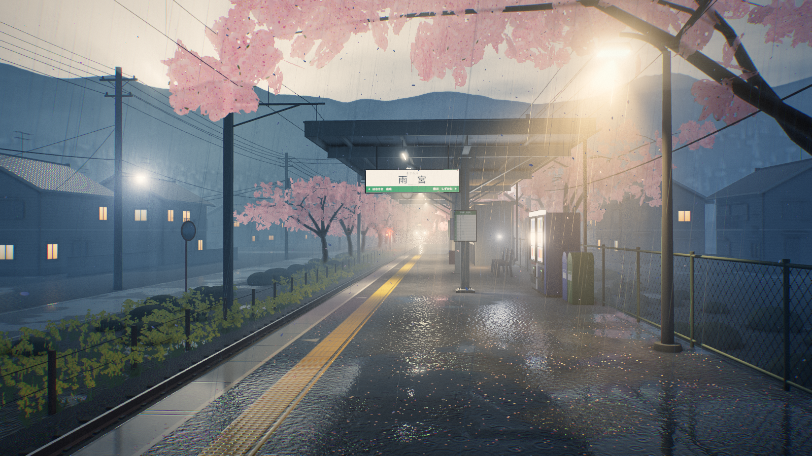

| 修改前 | 修改後 |
|---|---|
| 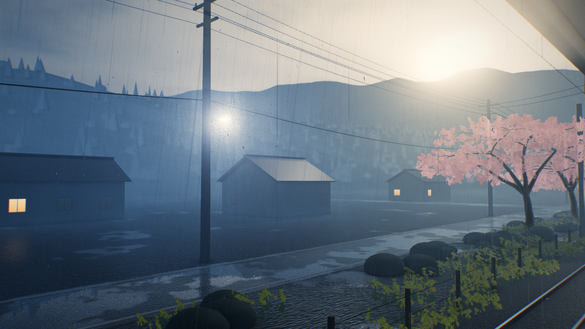 | 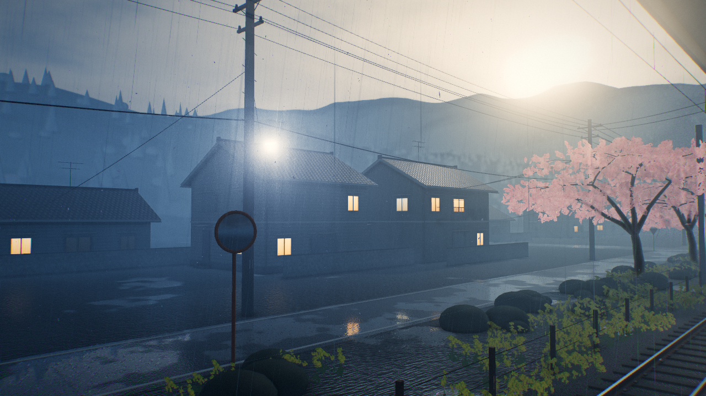 |

### 修改

1. **民家**：混凝土基礎；外牆為雨淋板（有法線貼圖）或砂漿；二樓腰帶。屋頂是程序生成的いぶし瓦貼圖，含屋脊、鬼瓦、破風板與鼻隱板，簷口有半圓雨水槽，牆角有落水管。
2. **開口部**：窗戶都有鋁框、中框、窗台和小雨遮；約三分之一關上雨戶並附戶袋，其餘隨機亮燈或不亮。另有玄關門、台階與雨遮。
3. **生活感**：二樓陽台附欄杆與曬衣竿、室外空調機、空心磚圍牆、屋脊上的八木天線。
4. **電線桿**：橫擔加斜撐，裝上礙子；交錯的腳踏釘、編號牌、支線與黃色護套；變壓器加上蓋與套管。並從電線桿拉引込線到附近的民家。
5. **街道**：平交道旁與民家前各一面カーブミラー，平交道前有「止まれ」標誌。

## Round 8：植物與地表

### 修改

1. **杉林**：由規則的尖錐改為四層不規則錐狀樹冠加樹幹；樹冠邊緣用噪聲打亂並微微下垂，頂點色帶層間陰影。
2. **闊葉樹與灌木**：改成數團經噪聲變形的球體合成的葉叢，頂點色烘上「下方較暗、中心較暗」的自遮蔽。
3. **草叢**：約 4200 叢十字交叉草卡，分佈在道碴肩、月台側壁腳、鐵道邊草地、道路兩側，以及圍欄下月台裂縫裡的雜草。
4. **櫻花細枝**：近景的櫻花樹在每個枝端再長三根細枝，樹冠邊緣的輪廓更細碎。

### 中途發現的問題

- 第一次加細枝後，主櫻樹整棵變形，樹冠變稀、主枝移位。原因是細枝和主結構共用同一個亂數序列，多抽了亂數就改變了後續所有分枝。改為細枝使用獨立的亂數序列，主樹恢復原本的造型。
- 植物面數一開始讓三角形數跳到 202 萬。場景每幀要畫陰影、兩個反射、SSAO 法線與主畫面，因此降低遠山植物與灌木的細分，最後控制在 111 萬。

### 檢查

- **主畫面**：光影、大氣與色彩的數值與第 5 輪幾乎一致（見總覽表），建模變細並沒有破壞原本的畫面。
- **特寫**：車站設施、上屋鋼構、民家與軌道在 1–5 m 的距離下都有可信的結構細節。

---

# 真實感（第 9–12 輪）

使用者的回饋是「還是有些假」，並舉櫻花與電線桿為例。先為這兩者加上特寫機位 `?cam=sakura`、`?cam=street`，拍下修改前的基準（`round-9/before/`），逐項找出「一看就知道是 CG」的原因：

| 部位 | 看起來假的原因 |
|---|---|
| 櫻花 | 花卡是一整片粉紅紙片，看不出一朵朵花，還散佈暗色斑點；枝幹是幾段直管折起來；從樹下看是一片均勻的灰紫色 |
| 鏡頭 | 從 3 m 到 3 km 全部清晰，沒有任何焦外 |
| 電線桿 | 一根深色圓柱加一支 T 字橫擔，比較像西式木桿；每跨只有 6 條線 |
| 街道 | 道路與民家之間隔著 7–15 m 的空地，住宅區顯得空曠 |
| 表面 | 每個表面都像剛完工一樣乾淨 |
| 窗戶 | 亮燈的窗戶是一整片均勻的黃色 |
| 生活感 | 月台外只有空地，看不出有人在這裡生活、通勤 |

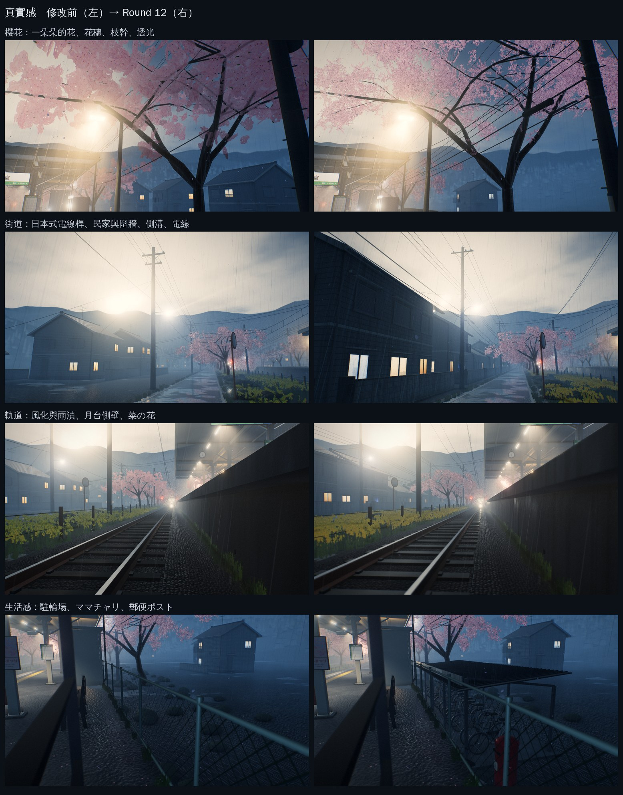

| 輪次 | 場景三角形數 | 櫻花花卡 |
|---|---|---|
| 8 | 111 萬 | 17,436 |
| 9 | 123 萬 | 29,561 |
| 10 | 135 萬 | 29,561 |
| 11 | 135 萬 | 29,561 |
| 12 | 140 萬 | 31,591 |

主畫面的數值（見總覽表）在這四輪幾乎不變：
- **整體飽和度**：第 9–11 輪從 0.249 降到約 0.234，因為櫻花改成更接近實物的淡粉白。第 12 輪把粉色與菜の花的黃色調回來後，回到 0.242。
- **下帶飽和度**：從 0.26 降到 0.23，來自景深讓前景失焦。用 `debug=nodof` 重拍第 12 輪，下帶飽和度回到 0.26，與第 8 輪相同。

## Round 9：櫻花與鏡頭

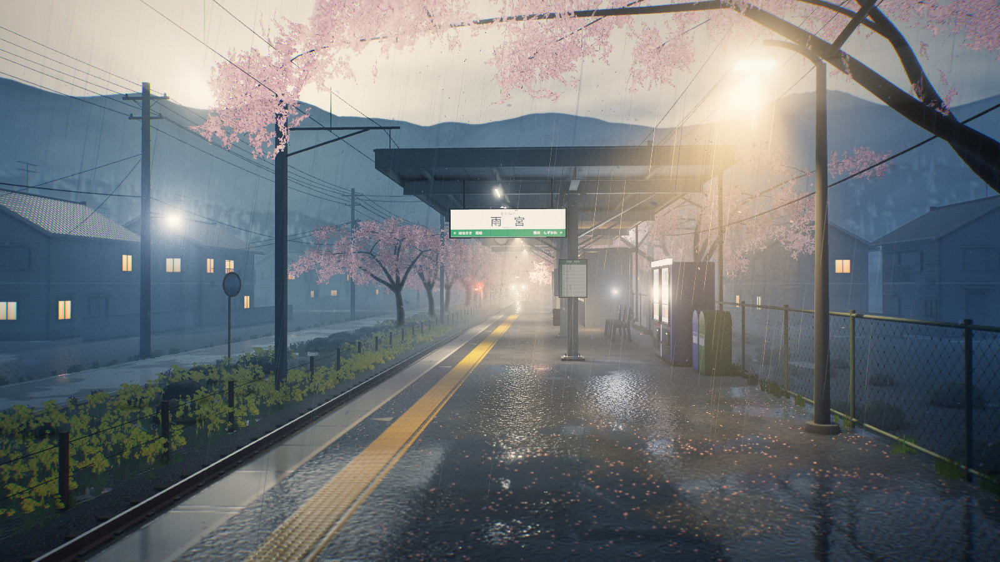

| 修改前 | 修改後 |
|---|---|
| 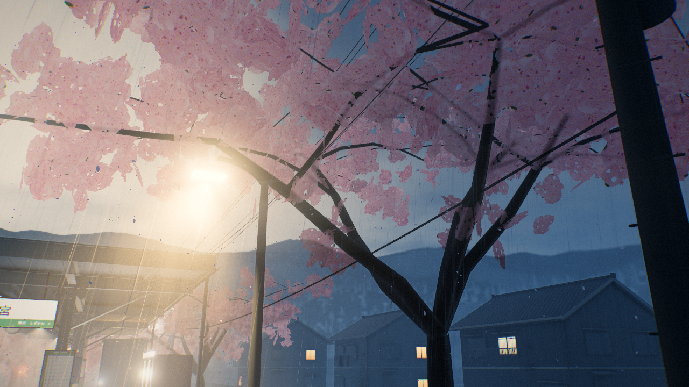 | 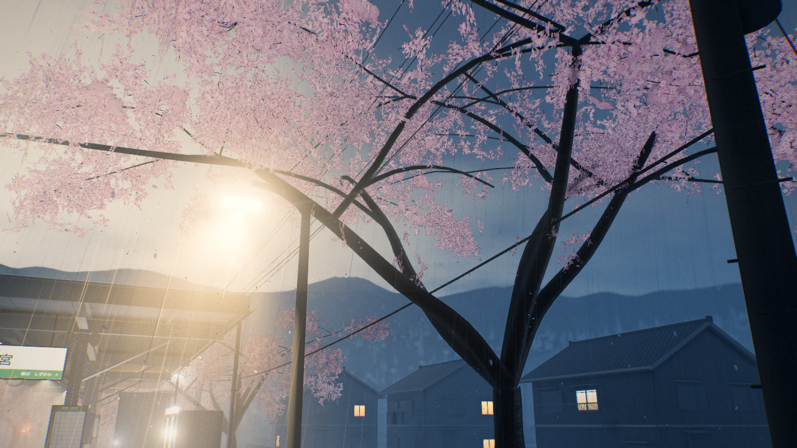 |

### 修改

1. **花的貼圖**：重畫成 2×2 atlas，每格 512²。
   - 三格是「花穗」：一段濕黑的細枝，每節長出 3–5 朵帶花梗的傘形花序，夾雜花苞，並留下大量空隙。
   - 一格是密集的花團，給遠方的樹使用。
   - 每朵花有五片帶缺刻的花瓣，基部粉紅、邊緣近白，有紅色花心與花蕊，並依朝向壓扁來表現透視。
2. **樹冠結構**：近景的樹（主樹、右側兩棵，以及左側 70 m 以內的幾棵）在每個枝端放數十張花穗，舊枝上只長小花穗（胴吹き），不再放大張密花卡。遠方的樹維持大張密花卡。花卡總數 1.7 萬 → 3.0 萬張。
3. **枝幹**：控制點用 Catmull-Rom 曲線平滑，不再有折角；主幹根部外擴並帶輕微起伏。樹皮調暗，做成濕樹皮。
4. **花瓣的光**：花瓣很薄，兩面都受天光。法線改為更偏向上方，並加上天光穿透花瓣的透射項，從樹下往上看時最亮。
5. **Alpha 覆蓋率補償**：alpha-test 卡片在較低的 mip 裡，平均 alpha 會掉到門檻以下，遠處的花穗會整片消失。改為依 mip 等級放大 alpha。
6. **景深**：
   - 依薄透鏡模型計算每個像素的模糊圓（CoC）。
   - 在半解析度做 scatter-as-gather 散景：失焦的前景可以蓋到清晰的背景上，清晰的前景不會滲進失焦的背景。
   - 再依模糊量與全解析度畫面混合。
   - 主畫面對焦 15 m（站名牌），前景月台自然失焦。飄落的花瓣在粒子 shader 裡用同一個 CoC 放大並變淡。

### 中途發現的問題

- 第一次重建後，樹冠下緣有幾張大的密花卡，從樹下看像一塊塊平板。改為在舊枝上只放小花穗。
- 花色偏灰紫，從樹下看太暗。原因是法線朝外朝下，只收到地面方向的環境光。加入天光透射、法線偏上，並減弱樹冠內側的陰影。

### 檢查

- **特寫**：看得到枝幹骨架，花沿著枝條開，樹冠有縫隙透出天空。
- **主畫面**：上緣的樹冠輪廓更細碎、帶透光；前景月台的輕微失焦讓畫面更像鏡頭拍出來的。

## Round 10：電線桿、架線與街道

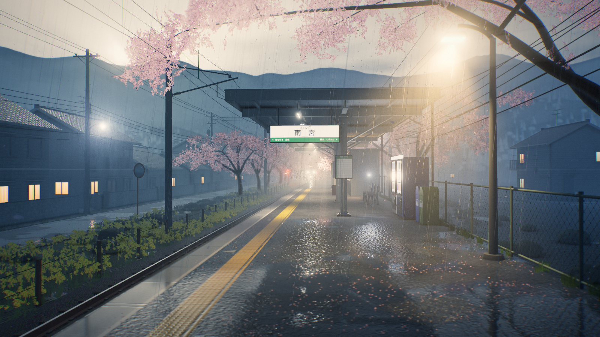

| 修改前 | 修改後 |
|---|---|
| 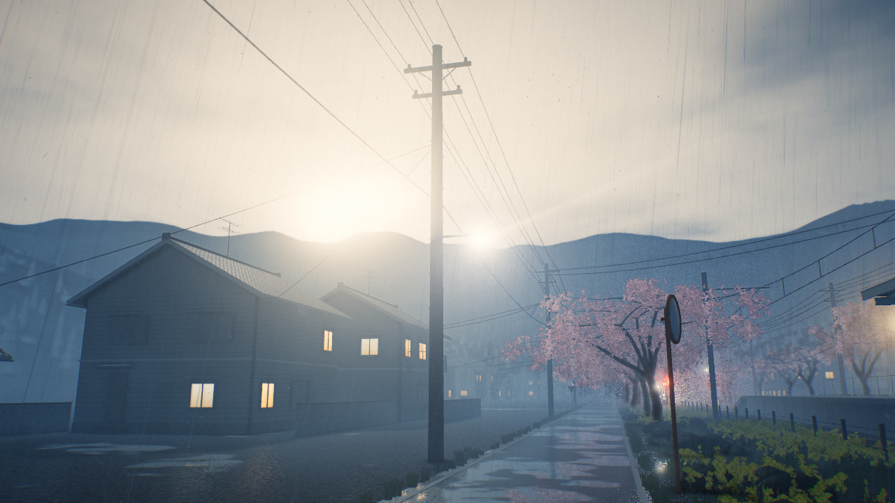 | 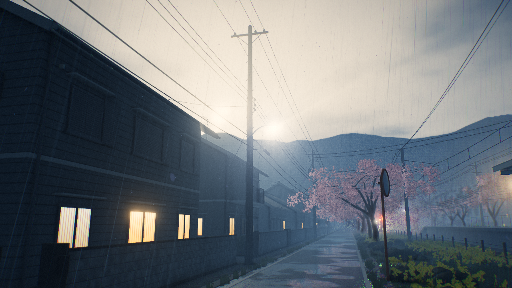 |

修改前的圖是用第 9 輪的場景，從新的 `street` 機位拍攝。

### 修改

1. **コンクリート柱**：直徑 35 → 19 cm 的錐形柱，頂端為圓頂。由上而下依序是：
   - 6.6 kV 橫擔、斜撐與白色針式礙子；
   - 每隔一根：第二支橫擔與三個高壓カットアウト，以及 1–2 個柱上變壓器（散熱片、套管、引下線）；
   - 低壓ラック與線軸礙子；
   - 通訊電纜吊架與電纜接續箱（クロージャ）；
   - 支線與黃色護套；接地線與灰色保護管；腳踏釘；
   - 巻き看板（たなか内科、雨宮不動産、そろばん教室、森田歯科）與藍色的住所表示「雨宮町二丁目」；
   - 部分柱子有伸向道路的 LED 防犯燈。
2. **電線**：每跨 3 條高壓線、3 條低壓線、2 條粗通訊電纜，各有不同的高度與垂度。引込線改從低壓ラック拉出。
3. **架線**：鋼管柱配可動ブラケット（上下兩支鋼管，各帶一支長幹礙子）、吊架線夾與曲線引金具。柱頂加上饋電線（立式礙子）與架空地線。
4. **街道**：
   - 道路旁改為一排緊鄰的民家，圍牆線就在電線桿後方 0.6 m。
   - 空心磚圍牆與門柱（信箱、表札），牆內有灌木與庭樹，側牆邊有兩支桶裝瓦斯。房屋間的空位停著輕型車。
   - 後方再一排民家。
   - 道路兩側加上側溝的混凝土蓋板，每 0.5 m 一塊，附排水孔。
5. **檢查工具**：`?cam=x,y,z,tx,ty,tz` 可以把鏡頭放在任意位置，用來近看單根電線桿。

### 中途發現的問題

- 逆光拍電線桿只剩剪影，無法確認細節。改從順光側檢查，確認橫擔、變壓器、ラック與クロージャ都在正確的位置與高度。

### 檢查

- **特寫**：街道已經像日本住宅區的小路：電線桿緊貼路邊，圍牆、門柱、瓦斯桶沿路排列，頭上是多層垂度不同的電線。
- **主畫面**：左側從空地變成連續的民家與圍牆，層次更密。

## Round 11：風化、窗戶與菜の花

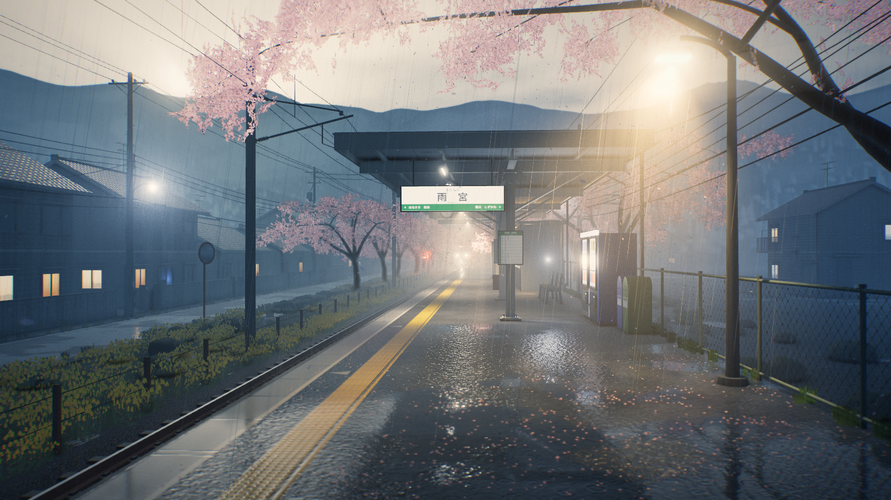

| 修改前 | 修改後 |
|---|---|
|  | 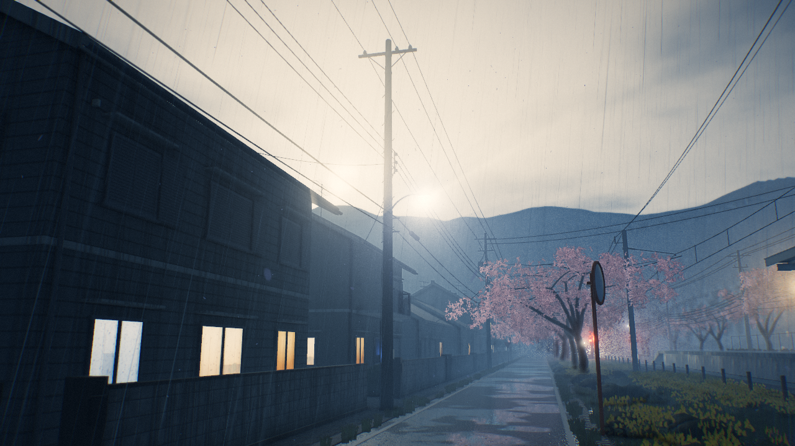 |

### 修改

1. **世界座標風化 shader**：套用在混凝土、電線桿、空心磚、基礎、鍍鋅鋼、民家外牆與瓦。
   - 大尺度的斑駁；
   - 沿垂直面流下的雨漬；
   - 牆腳偏綠偏暗的藻類與泥水；
   - 雨天濕潤：變暗、粗糙度降低，上屋下幾乎不濕。
   - 因為在世界座標計算，合併成同一個 batch 的物件也會連續變化，不會每個物件都一樣。
2. **窗戶**：4×2 的室內 atlas，分別是蕾絲窗簾、拉開的厚窗簾、型板玻璃、有人影的障子、百葉窗、拉上的窗簾、廚房，以及只有電視光的暗房。每格都有玻璃上的雨滴與引き違い窓的窗框。顏色在貼圖裡，亮度依窗戶個別設定。
3. **菜の花**：重畫成有分枝的花莖、由下往上開的四瓣小花、頂端的綠色花苞與披針形葉。

### 中途發現的問題

- 新的菜の花小花太小，加上 alpha-test 在遠處流失覆蓋率，主畫面的黃色帶幾乎消失。加大、加密花序，草卡也改用 mip alpha 補償後，黃色帶恢復。
- 近處窗戶亮度太高，室內細節被洗成白色。亮度降到約 1.0–1.3。
- 月台側壁在濕潤變暗後幾乎全黑。把基底色提亮到一般混凝土的反照率。

## Round 12：生活感（最終）

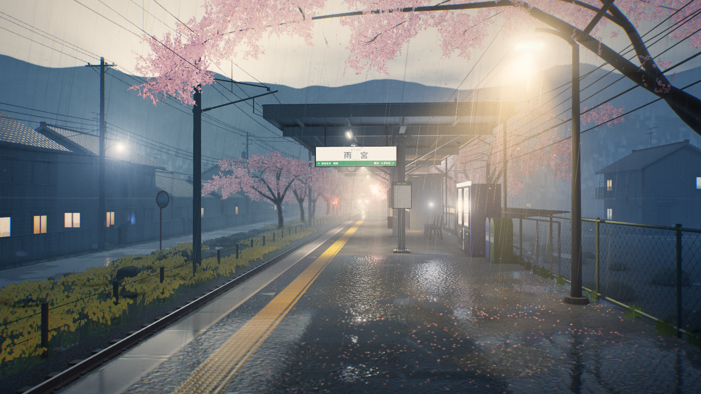

| 修改前 | 修改後 |
|---|---|
| 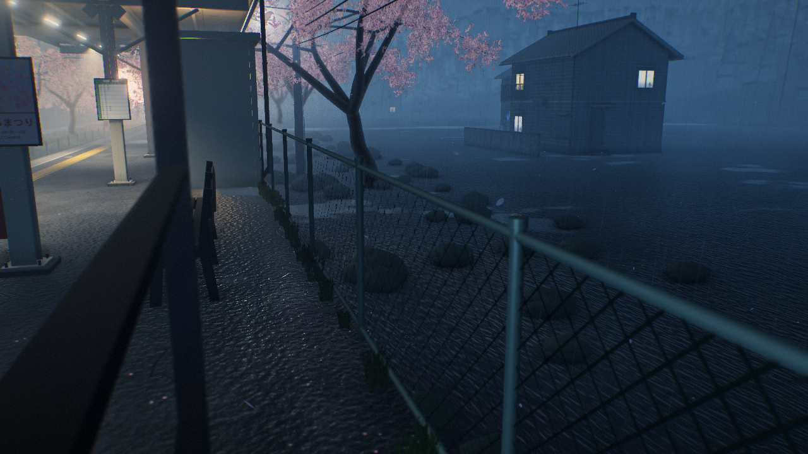 | 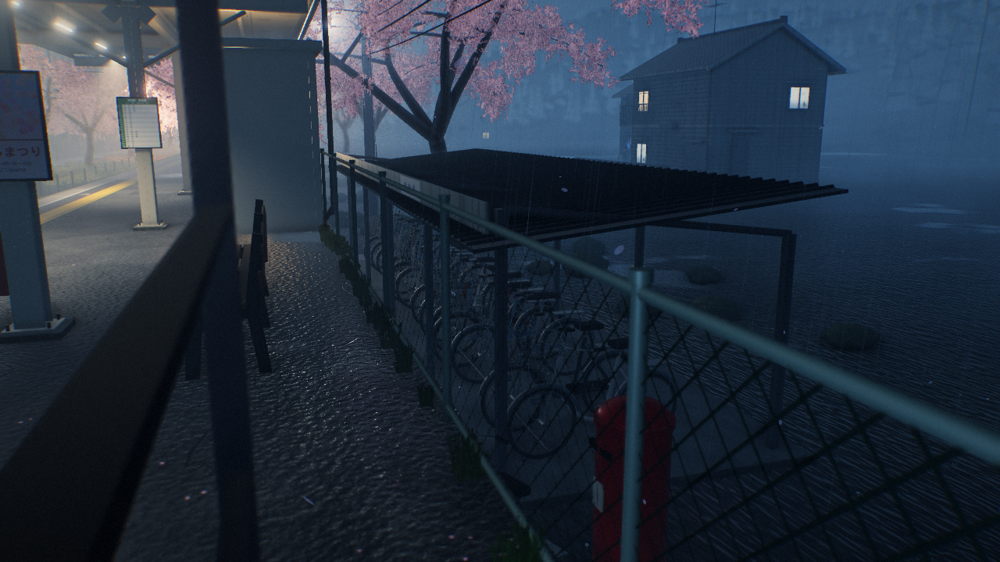 |

### 修改

1. **駐輪場**：
   - 混凝土地坪、方管柱、單斜浪板屋頂、「駐輪場」招牌、車輪架；
   - 十幾台ママチャリ，有前籃、後架、鏈罩、擋泥板、輻條與腳架，顏色各異、角度略有不同；
   - 其中一台停在棚外淋雨。
2. **郵便ポスト**：紅色圓柱郵筒，有圓頂、兩個投入口與收件時間牌。
3. **ビニール傘**：一支收起的透明傘，靠在長椅邊（[特寫](round-12/after/umbrella.png)）。

### 1080p 驗收時發現的問題

前面幾輪的測試圖多是 1280×720。在 1920×1080 與第 8 輪並排比較時，發現兩個問題：

- **樹冠**：比第 8 輪淡得多，在亮天空前幾乎成了灰白的蕾絲，失去了畫面上緣的粉色。花瓣中段調回略深的粉色，每個枝端的花穗增加兩成，花卡 2.96 萬 → 3.16 萬張。
- **菜の花**：黃色在藍色霧光下變成橄欖色，看起來像枯草。花序加大、加密，葉子只留在下方三分之一，花卡的色調也偏向更飽和的黃。修改後在 1080p 是清楚的一條黃色花帶，看得出一枝枝的花序。

### 檢查

- **主畫面**：右側圍欄後多了棚頂的輪廓，其餘數值不變。
- **特寫**：駐輪場、郵筒、傘都能一眼認出。這類「有人剛剛在這裡」的痕跡，比再多一級幾何細分更能讓場景顯得真實。

最終 1920×1080 截圖：[`final-1920x1080.png`](final-1920x1080.png)
