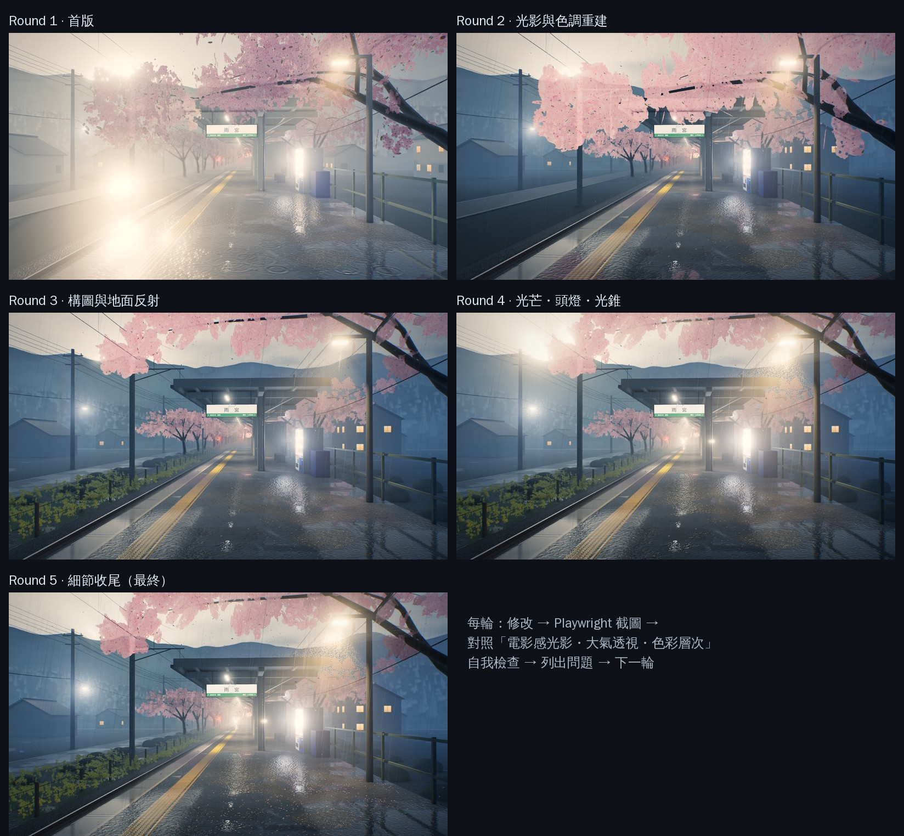
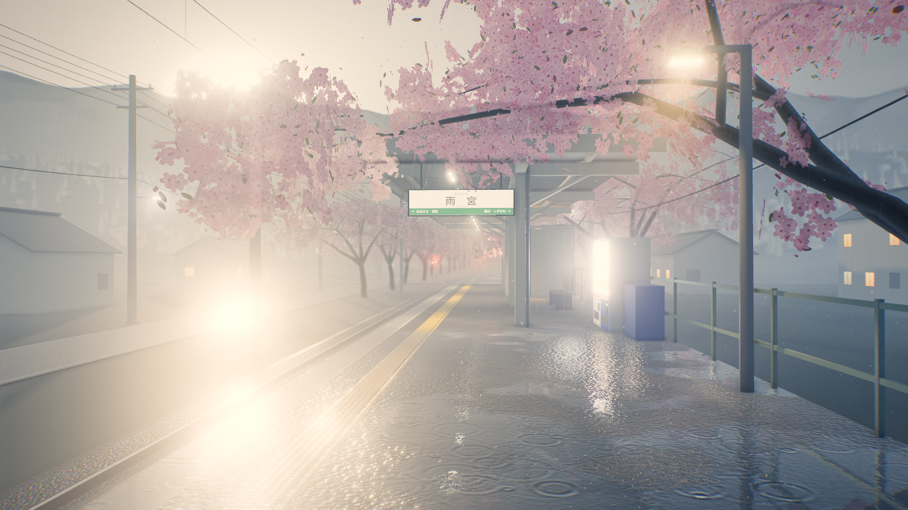
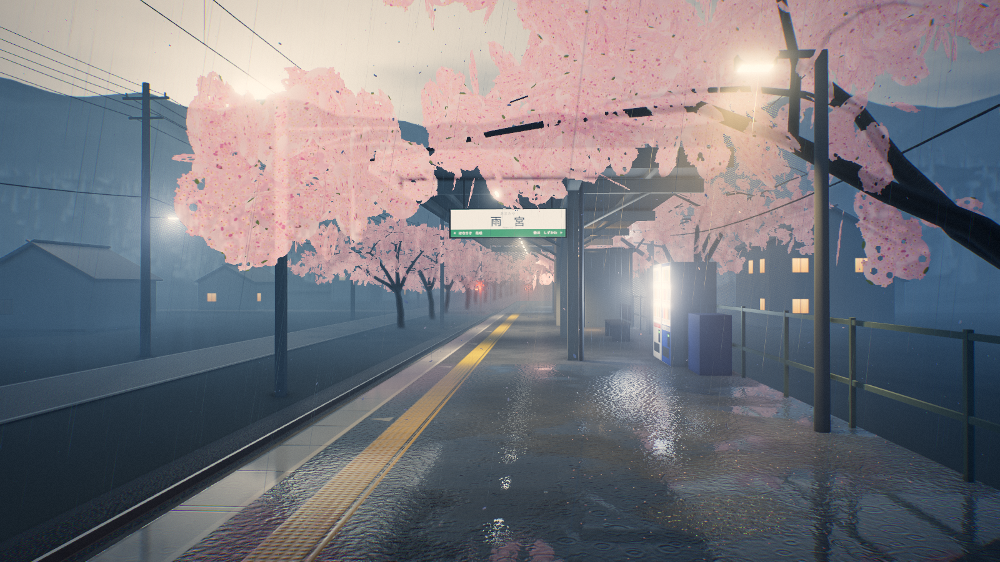
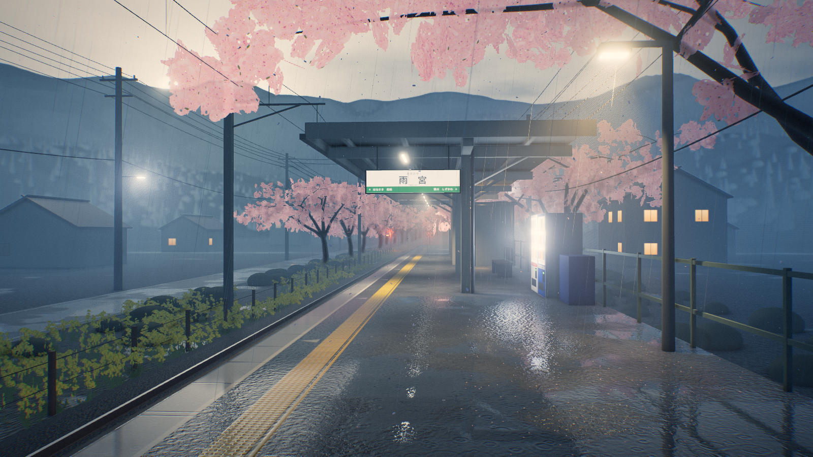
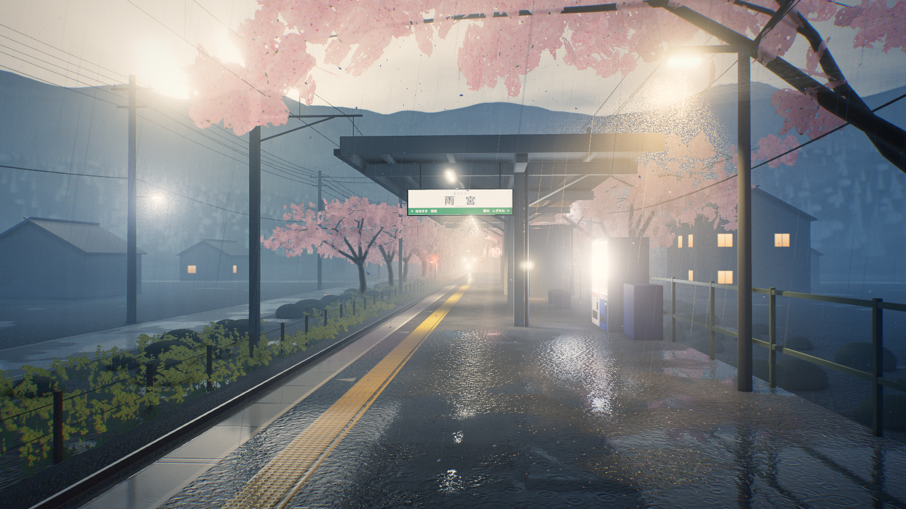
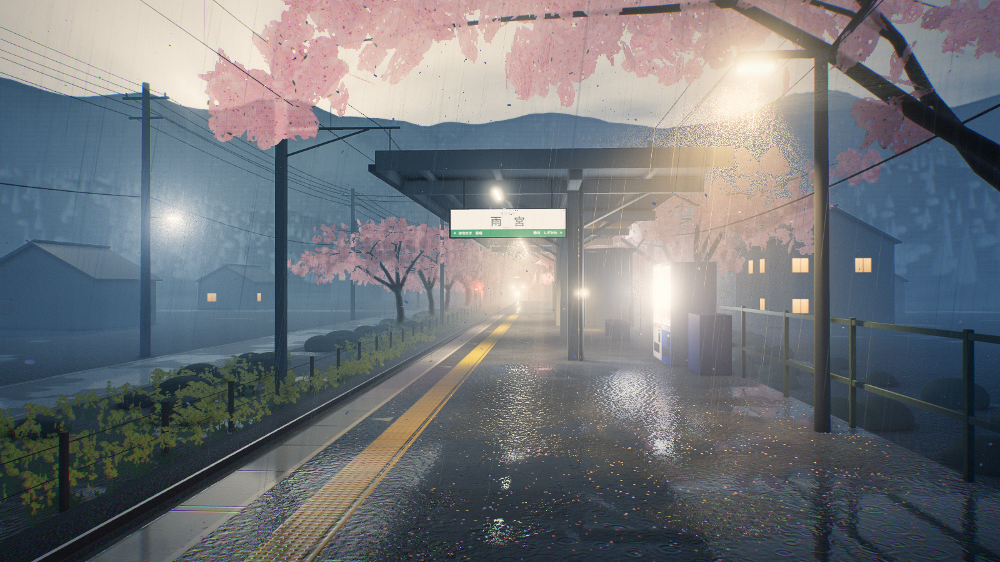

# 迭代紀錄：雨宮駅・春雨

## 流程

每一輪都照同一個循環進行：

1. 修改 `index.html`。
2. 用 Playwright（`tools/shoot.mjs`）截圖，時間固定在 `t=14.2`，解析度 1600×900，雨滴位置與號誌閃爍相位每輪都相同。
3. 對照三個檢查項目自我審查：**電影感光影**、**大氣透視**、**色彩層次**。需要時裁切局部放大，或用 `&debug=nofog / nofx / norays / ao` 關掉單一效果來定位問題。
4. 用 `tools/analyze.py` 量化截圖，作為肉眼判斷的佐證。
5. 列出問題，交給下一輪修正。

一輪之內若嘗試了幾次，下面會寫出中途發現的問題。每一輪的 HTML 快照與截圖都保存在 `round-N/`，可以直接開啟 `round-N/index.html` 看當時的即時版本。

### 指標說明

所有數值都以 sRGB 顯示值計算，範圍 0–1。

| 指標 | 意義 |
|---|---|
| `p5 / p50 / p95` | 亮度的 5% 分位、中位數、95% 分位：畫面有沒有真正的暗部與亮部 |
| `contrast` | p95 − p5 |
| `sat` | 平均飽和度 |
| `warm / cool` | 明顯偏暖（R > B）與明顯偏冷（B > R）的像素比例 |
| 三帶 `L / σ / S` | 畫面上、中、下三等分各自的平均亮度、亮度標準差、飽和度 |

三帶數值只用來追蹤天空亮度與前景暗度。中景帶同時包含最亮的燈與最鮮豔的櫻花，所以大氣透視主要還是靠裁切圖目視判斷，不硬套數字。

### 各輪數值總覽（1600×900 截圖）

| 輪次 | p5 | p50 | p95 | contrast | sat | warm | cool | 上帶 L/σ/S | 中帶 L/σ/S | 下帶 L/σ/S |
|---|---|---|---|---|---|---|---|---|---|---|
| 1 | 0.339 | 0.661 | 0.942 | 0.603 | 0.140 | **0.61** | 0.19 | 0.69 / .154 / .15 | 0.68 / .157 / .12 | 0.61 / .215 / .15 |
| 2 | 0.158 | 0.432 | 0.839 | 0.682 | 0.257 | 0.35 | 0.53 | 0.65 / .183 / .22 | 0.46 / .172 / .29 | 0.30 / .129 / .27 |
| 3 | 0.176 | 0.416 | 0.796 | 0.620 | 0.259 | 0.25 | 0.60 | 0.57 / .199 / .23 | 0.45 / .141 / .29 | 0.32 / .128 / .26 |
| 4 | 0.157 | 0.462 | 0.882 | 0.725 | 0.220 | 0.32 | 0.46 | 0.64 / .209 / .18 | 0.51 / .172 / .23 | 0.30 / .143 / .25 |
| 5 | 0.153 | 0.427 | 0.856 | 0.703 | 0.245 | 0.31 | 0.49 | 0.59 / .211 / .22 | 0.49 / .174 / .26 | 0.30 / .139 / .26 |

---

## Round 1：首版完整場景

### 實作內容

- **場景**：單側月台，包含濕柏油、緣石、點字磚與內方線；月台上有上屋、日光燈、吊掛站名標「雨宮」、自動販賣機、長椅、候車室與燈柱。另有單線鐵軌、架空電車線、路邊電線桿與電線，遠處是亮著紅燈的平交道。櫻花含一棵主樹、一整排行道樹，遠山上也有櫻花；再加上民家、地形、杉林。
- **管線**：場景本身渲染到 4× MSAA、HalfFloat、帶深度貼圖的 RT。後處理依序為 SSAOPass、體積霧、粒子、UnrealBloomPass、OutputPass（ACES 色調映射）、顯示空間調色。
- **濕地面**：月台平面做平面鏡射（oblique near-plane 裁切）。反射依粗糙度取 mip 並加上垂直拉長取樣，再乘上 Fresnel。水窪遮罩與雨滴漣漪法線寫在 shader 裡。
- **霧**：覆寫所有材質的 fog chunk，改為指數高度霧，並依太陽方向染色。另有一個 raymarch 體積霧 pass，使用 3D 噪聲，燈光以 HG 相函數散射。
- **粒子**：雨絲用 instanced 長條，另有屋簷滴水、濺水花冠、旋轉翻滾的櫻花瓣。粒子與場景深度比較做軟遮擋，並自行套用同一套大氣霧。

### 自我檢查

- **電影感光影 ✗**
  - 左側鐵軌上有巨大的白色光斑，並沿軌道延伸成光帶。用 `debug=nofog`、`debug=nofx` 排除後，光斑依然存在，所以不是霧也不是粒子。
  - 從螢幕座標反推這塊光斑所在的射線方位，是左偏 21.7°，與太陽方位 21.4° 吻合。結論：低角度方向光在低粗糙度的濕路面與鋼軌頂上形成鏡面高光。陰雨天不應出現這種硬直射光。
  - 整體過亮，燈光沒有「在昏暗中發光」的力量。
- **大氣透視 △**：遠方行道樹有漸層，但霧色太亮，連近景民家都被洗白，近、中、遠三層分不開。天空一片白，沒有雲的結構。
- **色彩層次 ✗**：灰白單調，飽和度只有 0.14；偏暖像素反而佔 61%，與雨天冷調相反。櫻花卡片上一朵朵大花太碎，看起來像雜訊。
- **其他**：雨絲幾乎看不見，因為背景太亮。漣漪太大太規則，半徑約 50 cm。

---

## Round 2：光影與色調重建

### 修改

1. **消除光斑**：先把方向光從 1.1 降到 0.3，陰天只保留一點方向感。第一次重拍後，路面與鋼軌上仍有兩個小光點，因此把「天空光暈的方向」與「實際照明的方向」拆開：
   - 天空與霧的太陽光暈維持低角度，保留逆光構圖；
   - 投影用的方向光抬高到仰角 40°，讓鏡面反射點落到畫面下緣以外。
2. **色調**：
   - 霧色 `#8d9ba8` → `#5f7383`，天頂 0.20 → 0.075；
   - 半球光 0.55 → 0.35，環境光 0.55 → 0.40，曝光 1.0 → 0.9；
   - 陰影的 split toning 更偏藍綠。
3. **天空**：加厚雨雲，雲底較暗；朝太陽的雲緣加上銀邊。
4. **櫻花**：
   - 第一次加深色調後，花團在 alpha-to-coverage 下變成網點狀的「紗窗」，原因是卡片大部分是空洞。
   - 因此重畫花卡：先畫實心的花團輪廓，上亮下深；再在輪廓與內部密布小花，邊緣讀起來是花瓣而不是圓盤；最後挖幾個透氣小孔。
   - 加入背光透射：當花團位於觀者與天空亮區之間時，發出暖色的透光。
5. **雨**：雨絲 alpha 0.32 → 0.6，並加寬、加長；燈光照亮雨絲的增益提高。體積霧裡加入垂直拉長、向下捲動的噪聲，形成遠處的雨幕。
6. **漣漪**：頻率約提高 2.2 倍，改為兩層疊加；非水窪處的強度降低。
7. **販賣機**：自發光 3.2 → 1.7，從死白恢復到看得見飲料。

### 自我檢查

- **電影感光影 △**：已經有雨夜車站的氣氛，冷霧與暖燈成對比。但主櫻樹樹冠擋住大半天空，缺少主光源的戲劇性。
- **大氣透視 ✓ / ✗**：山的剪影出來了。但左側鐵道邊是一整片平坦的暗色，而且地面層的道路與草地沒有任何反射。
- **色彩層次 ✓**：冷色 53%，飽和度 0.26，暗部 p5 從 0.34 降到 0.16。

---

## Round 3：構圖、地面反射、景深層次

### 修改

1. **第二個平面反射**：在地面高度 y = −1.41 加一面鏡射，道路、草地、平交道路面都能倒映燈光與櫻花。濕材質重構成可以指定要用哪一個反射平面，每種表面各自設定濕度、水窪閾值、反射強度與水窪尺度。
2. **主櫻樹**：往後、往右移，讓樹冠成為畫面上緣的「框」，露出天空與山稜線。第一次移動後，垂下的枝條擋住了站名牌，於是再把樹幹從 2.6 m 加長到 3.4 m。
3. **樹冠自遮蔽**：依花團到樹冠中心的距離與高度，算出每個 instance 的明暗。內側與下方較暗、偏深粉，外側上方較亮。
4. **鐵道邊細節**：加上木樁與鐵絲圍籬、灌木、菜の花（油菜花）。菜の花在青藍陰影與粉紅櫻花之間補上一條黃色帶。第一版灌木太黑太大，像黑色團塊，之後改小、改亮。
5. **鋼軌**：頂面反射提高到 envMapIntensity 2.6，找回通往消失點的引導線。第一次重拍時發現，環境光變暗後鋼軌幾乎消失了。

### 自我檢查

- **構圖 ✓**：前景是濕月台，中景是上屋與站名牌，遠景是行道樹與層層山稜，三層清楚。
- **電影感光影 ✗**：光線仍然偏平。沒有主光焦點，燈在雨中的光錐幾乎看不到，暗部也偏灰（p5 = 0.176）。
- **大氣透視 ✓**：遠山分成深淺數層，行道樹沒入霧中。
- **色彩層次 ✓**：黃、粉、青藍、暖燈與紅色號誌各有位置；冷色 60%。

---

## Round 4：電影感光影（光芒、列車頭燈、光錐、底片調色）

### 修改

1. **光芒（crepuscular rays）pass**：以太陽在螢幕上的投影點為中心，沿徑向取樣 64 次，只累積「深度等於 1 的天空像素、且亮度超過閾值」的光。樹冠、電線、上屋擋住的地方就形成一道道光束。
   - 中途用 `debug=norays` 對照，發現開與關的數值只差 0.01，光芒幾乎無效。因此強度 1.0 → 2.6，閾值 0.4 → 0.3。
2. **遠方進站列車（兩節）**：頭燈是朝鏡頭照來的 SpotLight，在霧中形成消失點上的焦點光，並在鋼軌上拉出反光。它也解釋了平交道為什麼在閃。
   - 第一次設 2600 cd 太強，整個中景被洗白：p50 升到 0.53，暖色反而多於冷色。
   - 改為 900 cd、散射增益 0.45 後，成為一團克制的光。
3. **光錐**：月台燈與上屋燈的體積散射增益提高；霧的步進距離 95 → 135 m，步數 44 → 56。
4. **消除網點**：放大裁切時發現，體積霧的 IGN 抖動在亮光錐裡留下規則網點。改用白噪聲抖動後，看起來像底片顆粒，也像光錐中的雨。
5. **調色**：Bloom 的大半徑 mip 偏暖，燈光周圍有底片般的 halation，正好對比冷色的霧。顯示空間調色加入 S 曲線，並降低補光（半球 0.35 → 0.28，環境 0.40 → 0.34）。
6. **花團體積**：花卡法線沿卡片向外彎曲，每個花團有球狀的明暗。

### 自我檢查

- **電影感光影 ✓**：三個光源形成三角：消失點的頭燈、左上的雲隙光、右側燈柱光錐裡的斜雨。對比 contrast 從 0.62 升到 0.73。
- **大氣透視 ✓**：頭燈的光暈讓消失點方向的霧有了深度，列車本體幾乎被霧吞沒，只剩燈。
- **色彩層次 △**：前景除了倒影，缺少粉紅色的點綴，而前、中、遠三層都應該有櫻花色。太陽區域略為過曝。

---

## Round 5：細節收尾（最終）

### 修改

1. **地上落花**：從 1400 片增加到約 5200 片。落點用與 shader 相同的水窪噪聲計算，花瓣集中在水窪邊緣、漂在水面上、沿著圍欄與月台邊緣堆積，每片有新舊色差。前景因此也有了粉紅色。
2. **空中花瓣**：主樹下的花瓣加多，並在鏡頭前加一小群近景花瓣。
3. **近鏡頭雨層**：鏡頭前 2–5 m 內加一層寬而淡的雨絲，模擬失焦的近距離雨滴，加強景深感。
4. **太陽**：光暈與光芒強度略降，避免死白。
5. **自適應解析度**：只在即時模式啟用。若平均幀時間超過 1/28 秒，自動降低 render scale，最多兩次。用 `?q=` 指定畫質時不會觸發。

### 最終檢查

- **電影感光影 ✓**：焦點光源清楚、雨中光錐可見、燈光倒映在濕地面上，冷暖對比明確。
- **大氣透視 ✓**：以濕月台與落花為前景，上屋、站名牌與行道樹為中景，沒入霧中的列車燈、平交道與數層山稜為遠景。
- **色彩層次 ✓**：主調是青藍霧；暖色點綴有燈、窗與 halation；另外有粉紅櫻花（前、中、遠三層）、黃色菜の花、紅色號誌、綠色站名牌帶。冷 49% / 暖 31%，飽和度 0.245。

最終 1920×1080 截圖：[`final-1920x1080.png`](final-1920x1080.png)
